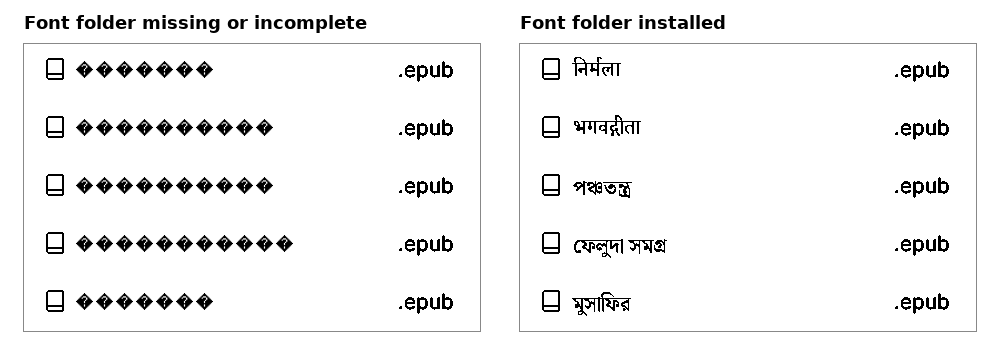

# CrossIndix

Read Bengali and Hindi books on your Xteink.

CrossIndix is reader firmware for the Xteink X3, X4 and X4 Pro. It is
[CrossInk](https://github.com/uxjulia/CrossInk) with one addition: Bengali and Devanagari text
renders properly. Conjuncts, vowel signs and marks look the way they do in print, and book
titles in these scripts show correctly in the library.

Languages covered: Bangla and Assamese (Bengali script); Hindi, Marathi, Nepali and Sanskrit
(Devanagari script).

## What you need

- An Xteink X3, X4 or X4 Pro.
- A USB-C cable and a computer, to install the firmware once.
- Your books as EPUB files. Almost any EPUB bought or downloaded today is fine. Scanned PDFs
  are not.

## Install in four steps

1. **Install the firmware.** Download the file for your device from the Releases page:
   `crossindix-<version>-x4-pro.bin` for the X4 Pro, `crossindix-<version>-x4-classic.bin` for the
   X4 Classic, `crossindix-<version>-x3-x4.bin` for the X3 and X4. Then follow the flashing
   guide in [docs/installation.md](docs/installation.md). Your books and settings on the SD
   card are not touched.

2. **Copy the fonts.** Download the font folder for your script from the same Releases page
   (`NotoSerifBengali` or `NotoSerifDevanagari`) and copy the whole folder into the `.fonts`
   folder on the SD card, so it looks like this:

   ```
   SD card
   └── .fonts
       └── NotoSerifDevanagari
           ├── NotoSerifDevanagari_8.cpfont
           ├── NotoSerifDevanagari_10.cpfont
           └── ...
   ```

   Both folders can be installed side by side. The `.fonts` folder is hidden on some
   computers; create it if it is not there. On the X4 Pro you can also do this over USB from
   the device: Home > File Transfer > USB Drive.

3. **Copy your books** onto the SD card as usual.

4. **Choose the font.** On the device go to Settings > Reader > Font Options > Font Family and
   pick NotoSerifBengali or NotoSerifDevanagari. Open a book and read.

Book titles and file names in Bengali or Devanagari appear correctly in the library as soon
as the font folder is on the card, whatever font you read with.

## What to expect

- Text matches what a computer or phone would show for more than 99 words in 100 in Bengali
  novels and Hindi novels. Classical Sanskrit, with its long compound words, is around 95 in
  100; the rest differ only in the width of a vowel sign before a conjunct.
- Bengali has been used daily on an X4 Pro. Devanagari has been tested in the emulator and is
  waiting for its first reader with a device.
- Page turns are as fast as with any other font.

## If something looks wrong

**Black diamonds instead of letters.** The device draws this symbol for every letter it has no
font for. On the left is the library with the font folder missing, on the right the same list
once it is installed.



Copy the whole font folder again, including the `_8`, `_10` and `_12` files. Those three sizes
are what the library, menus and status bar use. Without them, titles show as diamonds even
though the books themselves open fine.

**Conjuncts split into separate letters with a hasanta**, for example ক ্ ষ instead of ক্ষ. The
font came from the ordinary CrossInk font store. Only the folders on this project's Releases
page carry the extra data that joins letters.

**A book in another Indian script** (Tamil, Gujarati, Punjabi, Telugu, Kannada, Malayalam,
Odia, Sinhala) shows letters but no conjuncts. Those scripts are not supported yet.

## Fonts

The fonts are Noto Serif Bengali and Noto Serif Devanagari by Google, free under the SIL Open
Font License. Other fonts can be prepared for this firmware; ask in the issues if you have a
favourite.

## Credits

CrossIndix is built on CrossInk by [uxjulia](https://github.com/uxjulia/CrossInk), which is
itself based on CrossPoint. It is a separate project and is not part of either. Feedback, and
reports of books that render badly, are welcome in the issues.

---

Everything below is the README of CrossInk, the firmware CrossIndix is built on, kept as it was
received. Its instructions apply to CrossIndix too, with the additions above.

# CrossInk

> **This is a personal fork of [CrossPoint Reader](https://github.com/crosspoint-reader/crosspoint-reader)** with a focus on improved fonts and minimal reading stats.

#### Supported Devices

- Xteink X3
- Xteink X4
- Xteink X4 Pro
- Xteink X4 Classic
- Seeed Studio Sticky

### What's different in this fork

My goal with this fork was to maintain the core Crosspoint firmware while integrating my preferred typography and some lightweight reading statistics. I’ve focused on keeping the underlying system stable while layering in a few "nice-to-have" features and UI refinements along the way.

<table>
  <tr>
    <td align="center">
      <br/>
      <em>Font: Bitter, Size: 12 pt, Margin: 15</em>
    </td>
    <td align="center">
      <br/>
      <em>Reading Stats with custom front button mapping shown</em>
    </td>
  </tr>
</table>

#### Highlights

- New reader fonts: Lexend Deca and Bitter.
- Music notation and selected supplemental Unicode glyph support to be able to render Project Hail Mary accurately.
- Added a custom `Minimal` theme and sleep screen option for the minimalists out there.
- Added a custom `Dashboard` theme and sleep screen option for reading stats enthusiasts.
- Reader font sizes: 10 pt, 12 pt, 14 pt, and 16 pt.
- Added ~~strikethrough~~ support.
- Made <u>underlines</u> thicker for better visibility.
- Added support for `<hr>` section breaks.
- Added support for "redaction" style rendering.
- Added improved support for tables with simple markup.
- Added ability to add bookmarks.
- Added ability to remap front buttons that only applies in the reader.
- Added Focus Reading and Guide Dots as optional reader modes.
- Added Force Paragraph Indents for books that render as one giant wall of text.
- Added ability to pin a sleep image as a favorite. The favorited image will always be displayed when your sleep settings are set to `Custom` or `Cover + Custom` (when no cover is available).
- Added more in-reader control remapping options for side buttons, short power button clicks, and long-press menu actions, and more.
- Added ability to mark a book as finished from the in-book menu. A pop-up will also display once 99% of the book is reached. This status allows tracking of total books read.
- Added ability to move finished books to "Read" folder.
- In-book menu to quickly adjust reader options without having to exit the book.
- Reading stats: total books read, total reading time, number of sessions, pages turned, average session time, pages turned per minute. You can also set your reading stats as your sleep screen.
- All-time reading stats [syncing](./docs/reading-stats-sync.md) between two CrossInk devices.
- Reading [progress sync](./docs/nearby-position-sync.md) between two CrossInk devices.
- Added customizable Auto Page Turn Interval (anything between 5-120 seconds).
- Added ability to view Recent Books as a 3x3 grid view.
- To view a more detailed list for each version, visit the [releases](https://github.com/uxjulia/CrossInk/releases) page to read release notes.

---

#### Reader Fonts

The default fonts have been replaced with Lexend Deca and Bitter. These fonts have been chosen specifically to improve reading fluency and e-ink performance. These 'sturdier' typefaces feature uniform stroke weights and open geometries, allowing the X4/X3 to render crisp, high-contrast text with font-aliasing on while significantly reducing ghosting and artifacts.

- [Lexend Deca](https://fonts.google.com/specimen/Lexend+Deca) - A research-backed sans-serif typeface designed to improve reading fluency. Lexend was engineered based on the theory that reading issues are often a design problem (visual crowding) rather than a cognitive one.
- [Bitter](https://fonts.google.com/specimen/Bitter) - A "contemporary" slab serif typeface for text, it is specially designed for comfortably reading on digital screens. The consistent stroke weight of Bitter helps it render particularly well on e-ink devices. The medium weight has been chosen specifically for improved rendering on the X4/X3.

The UI now uses [Inter](https://fonts.google.com/specimen/Inter) as the display font which has improved readability at smaller sizes.

#### Music and Supplemental Glyphs

- Built-in reader fonts include music notation, selected Cyrillic glyphs, and the Project Hail Mary CJK fallback ranges. Additional SD-card fonts retain emoji fallback support.

---

#### Font Sizes

CrossInk includes 10 pt, 12 pt, 14 pt, and 16 pt built-in reader font sizes.

See [SD Card Fonts](./docs/sd-card-fonts.md) for installing additional font families and size ranges.

---

#### Reader features

Reader Options, Focus Reading, Guide Dots, Force Paragraph Indents, reading stats, and finished-book behavior are documented in [Reader Features](./docs/reader-features.md).

#### Custom button actions

CrossInk adds configurable button shortcuts.

See [Controls](./docs/controls.md) for the full action list and defaults.

---

### Tips for the best reading experience

CrossInk runs on an ESP32-C3 with limited RAM, so very large folders or complex EPUBs can be slower than they would be on a phone, tablet, or desktop app.

- Keep folders under about 200 files. For the smoothest browsing, aim for 50-100 files per folder.
- Having 1000+ books on the SD card is fine if they are split into smaller folders, such as by author, series, genre, or read/unread status.
- Avoid putting every book in the SD card root. The file browser has to scan and sort the current folder before it can show it.
- Text-first EPUBs are the best fit. Large image-heavy EPUBs, scanned books, comics, and omnibus files with thousands of sections may load slowly or fail under memory pressure.
- As a rough target, EPUBs under 20 MB tend to work the best. Files over 50 MB may still work, but they are more likely to be slow or memory-sensitive, especially if they contain many large images.
- If an EPUB is unusually slow, try [optimizing](./docs/webserver.md#epub-optimization) it with the built-in web optimizer (via File Transfer) before copying it to the SD card: remove unused high-resolution images, split very large omnibus files, and avoid embedding multiple full font families when possible.
- Use a reliable SD card and leave some free space. CrossInk stores settings, reading progress, cache files, stats, and generated book data on the card.

---

### Installation

The fastest way to install Crossink is by using Inky, Crossink's web companion app: https://inky.crossink.dev/#flash-tools

Download a `firmware-*.bin` from the [releases page](https://github.com/uxjulia/CrossInk/releases), then flash it with the web installer or command line.

See [Installation](./docs/installation.md) for step-by-step flashing and revert instructions.

---

### Guides & Documentation

Visit [https://www.crossink.dev](https://www.crossink.dev) for more user guides and additional documentation.

---

### Development quick start

CrossInk uses PlatformIO for building and flashing firmware. See [Getting Started](./docs/development/getting-started.md) for prerequisites, clone setup, and validation commands.

#### Nix/NixOS

Nix/NixOS users can enter the development shell with either `nix develop` (flakes) or `nix-shell`:

```bash
nix develop -f nix
# or
nix-shell nix
```

To flash a connected ESP32-C3 device, enable PlatformIO's udev rules in your NixOS configuration:

```nix
services.udev.packages = with pkgs; [ platformio-core.udev ];
```

After rebuilding the system configuration, reconnect the device or reload udev rules.

#### Build / flash / monitor

Connect your device to your computer via a USB cable. Before the first build, initialize the repository's submodules (including `freeink-sdk`):

```sh
git submodule update --init --recursive
```

Then flash the firmware using the correct environment for the device. The `default` environment is for the X3/X4 devices. ESP32-S3 devices have their own named environments.

```sh
pio run -e default --target upload
```

If PlatformIO reports `PackageException: Can not create a symbolic link for freeink-sdk/libs/hardware/BatteryMonitor, not a directory`, the `freeink-sdk` submodule is not initialized. Run the submodule command above and retry.

See [Testing and Debugging](./docs/development/testing-debugging.md) for serial logging, simulator checks, static analysis, and bug-report guidance.

---

### Notice on Contributions

This repository does not accept pull requests. Feature requests may be opened in [discussions](https://github.com/uxjulia/CrossInk/discussions), but major features requiring ongoing support should be directed upstream to [CrossPoint](https://github.com/crosspoint-reader/crosspoint-reader).

---

If you'd like to show some love and support ongoing development, please consider supporting me on Ko-fi.

[](https://ko-fi.com/Q5Q01M6S7)
